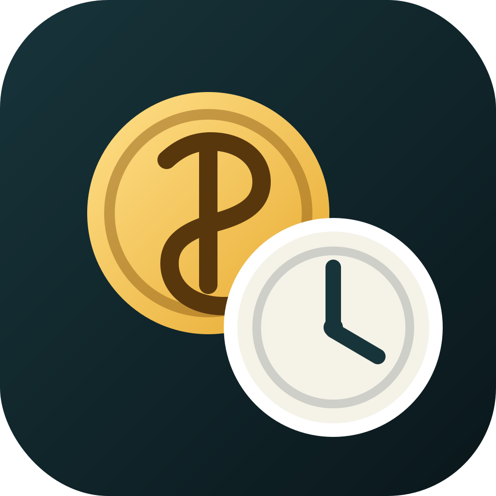

# SecondSalary

SecondSalary 是一个完全本地运行的 macOS 菜单栏工资计数器。设置月薪、当月工作日、上班时间和下班时间后，点击“开始搬砖”即可按实际搬砖时长实时查看今天已经“赚到”的工资。



## 功能

- 菜单栏常驻显示今日累计工资
- 在上班、午休和下班节点展示情感化气泡提醒
- 当天首次在工作时段内点击“开始搬砖”时，从设置的上班时间计算今日薪水
- 在工作时段外开始搬砖不会累计薪水，并显示“还未到工作时间”；到达下班时间后自动停止累计
- 一天内支持多次开始和结束搬砖，所有时段累计到同一条当天记录
- 可选每秒至每小时的界面刷新频率
- 系统睡眠、退出或关机时自动结束当前搬砖
- 跨过本地零点后自动开始新的当天记录
- 每次开始时保存当时的秒薪快照，修改设置不会改写已有金额
- 支持 CNY、USD、EUR、GBP、JPY、HKD、SGD、AUD 和 KRW
- 月薪与当天记录保存在 macOS 钥匙串
- 无网络请求、无分析 SDK、无云同步、无第三方运行时依赖

## 计算方式

```text
每日搬砖时长 = 下班时间 − 上班时间
秒薪 = 月薪 ÷ 当月工作日 ÷ 每日搬砖时长秒数
当天累计工资 = 各搬砖时段的秒薪快照 × 对应有效秒数之和
```

例如月薪 20,000 元、当月 21 个工作日、上班时间 09:00、下班时间 17:00，开始搬砖后一小时约累计 119.05 元。下班时间早于上班时间时，会按跨午夜班次计算。

刷新频率仅控制界面多久更新一次。实际金额始终根据搬砖开始和结束时间计算，不会因为选择每小时刷新而少算。

## 系统要求

- macOS 13 或更高版本
- Xcode 26 推荐
- Swift 6

应用目标支持 macOS 13；单元测试目标使用 macOS 14，因为当前 Xcode 自带的 XCTest 运行库最低为 macOS 14。

## 从源码运行

1. 克隆仓库。
2. 使用 Xcode 打开 `SecondSalary.xcodeproj`。
3. 选择 `SecondSalary` Scheme 和 `My Mac`。
4. 在 Signing 中使用 `Sign to Run Locally`，然后运行。

本机开发和从源码构建不需要付费 Apple Developer Program。由于 Developer ID 签名和 Apple 公证需要付费会员，本项目目前不提供未公证的二进制应用；请勿为了安装本项目而关闭 Gatekeeper。

命令行构建：

```sh
xcodebuild \
  -project SecondSalary.xcodeproj \
  -scheme SecondSalary \
  -configuration Debug \
  -derivedDataPath /tmp/SecondSalaryDerived \
  CODE_SIGNING_ALLOWED=NO \
  build
```

运行测试：

```sh
xcodebuild \
  -project SecondSalary.xcodeproj \
  -scheme SecondSalary \
  -configuration Debug \
  -derivedDataPath /tmp/SecondSalaryDerived \
  test
```

## 数据与权限

- 工资设置和当天搬砖记录存储在本机钥匙串。
- 刷新频率等非敏感偏好存储在应用自己的 `UserDefaults`。
- 登录时启动由 macOS `SMAppService` 管理，默认关闭。
- 应用启用 App Sandbox，不请求网络、通知、辅助功能、文件或管理员权限。
- 可在设置窗口中使用“删除全部本机数据”。

更多信息见 [隐私说明](PRIVACY.md)。

## 项目结构

- `Models`：工资设置、费率快照、计时片段与当天累计记录
- `Services`：计算、钥匙串、偏好与登录项
- `State`：应用状态、跨日和系统事件处理
- `Views`：菜单栏、弹层与设置界面
- `SecondSalaryTests`：计算和状态行为测试

## 参与贡献

参见 [CONTRIBUTING.md](CONTRIBUTING.md)。提交代码前请确保应用构建成功且全部测试通过。

## 许可证

Copyright (C) 2026 zhangyilin

本项目采用 [GNU General Public License v3.0 only](LICENSE) 发布。
